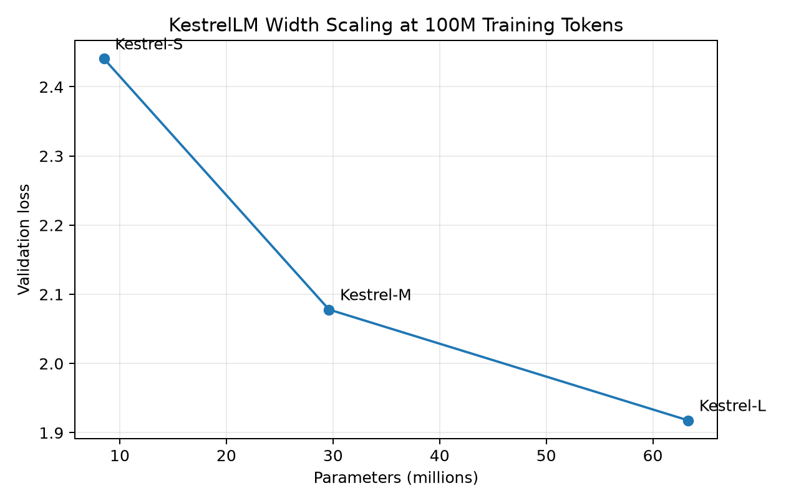

# KestrelLM

KestrelLM is a decoder-only Transformer language model built from scratch in PyTorch. The project covers the complete language-model pipeline: custom BPE tokenization, binary dataset preprocessing, causal Transformer implementation, pretraining, checkpointing, evaluation, autoregressive generation, KV-cached inference, performance benchmarking, and controlled scaling experiments.

The primary released model, **Kestrel-M**, contains **29.6M parameters** and was pretrained on **600M TinyStories tokens**, reaching a full-validation perplexity of **4.50**. Pretrained weights are published on Hugging Face as `SolusBolus/KestrelLM`, and generation automatically downloads the checkpoint when no local copy is available.

## Results

| Metric | Kestrel-M |
| --- | ---: |
| Parameters | 29,628,928 |
| Training tokens | 600,014,848 |
| Optimizer steps | 36,622 |
| Final training loss | 1.5309 |
| Validation tokens | 4,690,944 |
| Validation loss | 1.5031 |
| Validation perplexity | **4.4957** |
| Context length | 512 |
| Vocabulary size | 8,192 |

The validation metrics were measured over the complete held-out validation token stream. Training on an AMD Radeon RX 7900 XTX using ROCm reached approximately **72K tokens/s**; the final portion of the run, from roughly 160M to 600M tokens, completed in about **1 hour 37 minutes**.

For autoregressive inference with a 32-token prompt and 400 generated tokens, KV caching increased throughput from **308.37 to 456.50 tokens/s**, a **1.48× speedup**, while reducing latency from 3.243 to 2.191 ms/token.

## Architecture

KestrelLM uses a pre-normalized decoder-only Transformer. The released Kestrel-M configuration is:

| Component | Configuration |
| --- | --- |
| Transformer layers | 6 |
| Model dimension | 512 |
| Attention heads | 8 |
| Head dimension | 64 |
| Feed-forward dimension | 2,048 |
| Context length | 512 |
| Vocabulary size | 8,192 |
| Normalization | RMSNorm |
| Feed-forward network | SwiGLU |
| Positional representation | Learned positional embeddings |
| Attention | Multi-head causal self-attention |
| Output head | Tied to token embeddings |

The model flow is `token IDs → token + positional embeddings → 6 Transformer blocks → final RMSNorm → tied LM head → logits`.

Each Transformer block applies pre-normalized attention followed by a pre-normalized feed-forward network:

$$
H' = H + \mathrm{Attention}(\mathrm{RMSNorm}(H))
$$

$$
H'' = H' + \mathrm{SwiGLU}(\mathrm{RMSNorm}(H'))
$$

The SwiGLU feed-forward network is:

$$
\mathrm{SwiGLU}(H) = \left(\mathrm{SiLU}(HW_g) \odot HW_u\right)W_d
$$

The primary attention implementation is written directly in PyTorch rather than using `nn.Transformer`. Its computation is `H → Q/K/V projections → split heads → scaled QKᵀ scores → causal mask → softmax → weighted values → combine heads → output projection`.

For one attention head:

$$
\mathrm{Attention}(Q,K,V)
=
\mathrm{softmax}
\left(
\frac{QK^\top}{\sqrt{d_h}} + M
\right)V
$$

where $M$ is the causal mask. PyTorch scaled dot-product attention is also available as an optional backend for comparison with the handwritten implementation.

## Tokenizer and Dataset

KestrelLM is trained on **TinyStories** using a custom Byte-Level BPE tokenizer built with Hugging Face `tokenizers`. The vocabulary contains 8,192 tokens with the special tokens `<pad>`, `<unk>`, `<bos>`, and `<eos>`.

Every story is terminated with `<eos>` before the tokenized stories are packed into continuous streams. The resulting training and validation data are stored as `uint16` binary files and accessed through NumPy memory mapping.

Training samples are contiguous windows of $T+1$ tokens. Given

$$
[x_1,x_2,\ldots,x_T,x_{T+1}],
$$

the model receives

$$
X=[x_1,\ldots,x_T]
$$

and predicts

$$
Y=[x_2,\ldots,x_{T+1}].
$$

Training therefore uses standard autoregressive next-token prediction with token-level cross-entropy:

$$
\mathcal{L}
=
-\frac{1}{N}
\sum_{i=1}^{N}
\log p(y_i)
$$

## Training

The released 29.6M-parameter model used the following configuration:

| Setting | Value |
| --- | ---: |
| Optimizer | AdamW |
| Peak learning rate | $1\times10^{-4}$ |
| Minimum learning rate | $1\times10^{-5}$ |
| Warmup | 500 steps |
| LR schedule | Linear warmup + cosine decay |
| Adam β₁ | 0.9 |
| Adam β₂ | 0.95 |
| Weight decay | 0.1 |
| Gradient clipping | 1.0 |
| Physical batch size | 32 |
| Gradient accumulation | 1 |
| Effective batch size | 32 |
| Context length | 512 |
| Tokens per optimizer step | 16,384 |
| Optimizer steps | 36,622 |
| Total training tokens | 600,014,848 |

Parameters with two or more dimensions receive AdamW weight decay, while one-dimensional parameters such as RMSNorm scales are excluded.

Pretraining began on Apple MPS and was later migrated to an AMD Radeon RX 7900 XTX using ROCm without restarting the run. Training checkpoints store the model parameters, AdamW optimizer state, optimizer step, data-pass counter, processed-token count, and model configuration. Checkpoints are loaded onto CPU before model and optimizer tensors are moved to the active accelerator, making them portable between MPS, ROCm, CUDA, and CPU.

Checkpoint writes are atomic: the new state is first written to a temporary file and then replaces the rolling checkpoint.

## Scaling Study

To measure the effect of model capacity under a fixed data budget, KestrelLM was width-scaled into three configurations. All models use 6 Transformer layers, 512-token context, 64-dimensional attention heads, a 4× feed-forward expansion, the same 8,192-token tokenizer, the same TinyStories data, AdamW, batch size 32, and exactly **100,007,936 training tokens**. Only model width changes.

| Model | Parameters | d_model | Heads | d_ff | Validation loss | Perplexity |
| --- | ---: | ---: | ---: | ---: | ---: | ---: |
| Kestrel-S | 8,523,008 | 256 | 4 | 1,024 | 2.4405 | 11.4790 |
| Kestrel-M | 29,628,928 | 512 | 8 | 2,048 | 2.0780 | 7.9883 |
| Kestrel-L | 63,317,760 | 768 | 12 | 3,072 | **1.9178** | **6.8060** |



Increasing width consistently improved held-out performance at the same training-token budget. From Kestrel-S to Kestrel-L, parameter count increased by **7.43×** while perplexity fell from **11.4790 to 6.8060**, a reduction of approximately **40.7%**. The gain from S → M was larger than the gain from M → L, showing diminishing returns as model capacity increased.

The compute cost increased accordingly:

| Model | Training throughput | Peak VRAM |
| --- | ---: | ---: |
| Kestrel-S | 181,232 tokens/s | 5.39 GB |
| Kestrel-M | 72,206 tokens/s | 8.86 GB |
| Kestrel-L | 40,779 tokens/s | 12.48 GB |

The experiment therefore measures a direct quality-compute tradeoff: larger models achieved lower validation loss at the same data budget but required more time and accelerator memory.

The same Kestrel-M architecture also provides a controlled comparison along the training-data axis:

| Training tokens | Validation loss | Perplexity |
| ---: | ---: | ---: |
| 100,007,936 | 2.0780 | 7.9883 |
| 600,014,848 | **1.5031** | **4.4957** |

Together, the experiments show `more parameters at fixed tokens → better validation performance` and `more tokens at fixed parameters → better validation performance`.

## KV-Cached Inference

Naive autoregressive generation repeatedly recomputes the entire visible sequence: `process prompt → generate token → process the enlarged sequence again → generate token → repeat`.

KestrelLM instead stores previously computed keys and values for every attention layer:

$$
K_{\mathrm{cache}}=[K_{\mathrm{past}};K_{\mathrm{new}}]
$$

$$
V_{\mathrm{cache}}=[V_{\mathrm{past}};V_{\mathrm{new}}]
$$

After prompt prefill, each decoding step only computes projections for the newly generated token. Once the learned 512-position context is full, the cache is rebuilt from the newest context window.

Cached and uncached inference were verified numerically with a maximum logit difference of **0.00002861**, and greedy generation produced identical token sequences.

For a 32-token prompt followed by 400 generated tokens:

| Method | Throughput | Latency | Peak memory |
| --- | ---: | ---: | ---: |
| Full-context recomputation | 308.37 tokens/s | 3.243 ms/token | 0.180 GB |
| KV cache | **456.50 tokens/s** | **2.191 ms/token** | 0.161 GB |

The cache therefore produced a **1.48× speedup** and **32.4% latency reduction**. Its benefit grows with decode length because uncached generation repeatedly processes an increasingly long prefix.

## Optimization Experiments

Two additional inference optimizations were implemented and measured rather than assumed to be beneficial.

### Dynamic vs Preallocated KV Cache

The normal cache grows key/value tensors using `torch.cat`. A fixed-capacity preallocated implementation was also built and verified to reuse the same underlying tensor storage.

| Implementation | Throughput | Latency |
| --- | ---: | ---: |
| Dynamic cache | **456.50 tokens/s** | **2.191 ms/token** |
| Preallocated cache | 421.84 tokens/s | 2.371 ms/token |

At a 400-token decode horizon, preallocation was approximately **8% slower** despite slightly reducing peak memory. The dynamic implementation was therefore retained.

### Manual Attention vs PyTorch SDPA

PyTorch scaled dot-product attention was added as an interchangeable backend and numerically compared with the handwritten implementation. Maximum differences remained on the order of $10^{-5}$, and full/cached parity tests passed.

| Sequence length | Manual attention | SDPA | SDPA / Manual |
| ---: | ---: | ---: | ---: |
| 32 | 13,485 tokens/s | 13,972 tokens/s | 1.04× |
| 128 | 41,156 tokens/s | 44,021 tokens/s | 1.07× |
| 256 | 83,960 tokens/s | 85,026 tokens/s | 1.01× |
| 512 | **106,145 tokens/s** | 98,545 tokens/s | 0.93× |

For 400-token KV-cached generation, manual attention reached **479.73 tokens/s at 2.084 ms/token**, while SDPA reached **464.96 tokens/s at 2.151 ms/token**. Manual attention therefore remains the default for this model and ROCm workload.

These experiments intentionally preserve negative results: an implementation change is retained only when measurement shows an advantage for the target workload.

## Generation

Generation supports greedy decoding, temperature sampling, top-k filtering, top-p/nucleus sampling, deterministic seeds, `<eos>` termination, and KV-cached decoding.

Install the project and generate text with:

```bash
git clone git@github.com:Solus-dot/KestrelLM.git
cd KestrelLM
uv sync

uv run python src/generate.py \
    --prompt "Once upon a time" \
    --max-new-tokens 200 \
    --temperature 0.8 \
    --top-k 50 \
    --top-p 0.95
```

If neither `release/kestrel_30m.pt` nor `checkpoints/final.pt` exists locally, the generator automatically downloads `kestrel_30m.pt` from `SolusBolus/KestrelLM` through `huggingface_hub`.

An example TinyStories-style generation begins:

> Once upon a time, there was a big, big lion. He lived in a jungle with his friends. One day, he saw a little bird with a hurt wing...

KestrelLM is trained only on TinyStories and is intended as a small language-model implementation and systems project rather than a general-purpose assistant.

## Reproducing Training

KestrelLM requires Python 3.12+ and uses `uv`.

Prepare the dataset and tokenizer:

```bash
PYTHONPATH=src uv run python scripts/download_dataset.py
PYTHONPATH=src uv run python scripts/train_tokenizer.py
PYTHONPATH=src uv run python scripts/preprocess_data.py
```

Train the standard Kestrel-M configuration:

```bash
uv run python src/train.py --model medium --steps 36622
```

The available sizes are `small = Kestrel-S (8.52M)`, `medium = Kestrel-M (29.63M)`, and `large = Kestrel-L (63.32M)`.

A named experiment receives its own checkpoint directory:

```bash
uv run python src/train.py \
    --model large \
    --steps 6104 \
    --run-name scaling/kestrel_l
```

Passing `--resume` continues from that run's `latest.pt`.

The scaling study uses 6,104 steps per model:

$$
6104 \times 32 \times 512 = 100,007,936
$$

```bash
uv run python src/train.py --model small  --steps 6104 --run-name scaling/kestrel_s
uv run python src/train.py --model medium --steps 6104 --run-name scaling/kestrel_m
uv run python src/train.py --model large  --steps 6104 --run-name scaling/kestrel_l
```

## Evaluation, Tests, and Benchmarks

Evaluate any trained checkpoint over the complete validation stream with:

```bash
PYTHONPATH=src uv run python scripts/evaluate.py \
    --checkpoint checkpoints/final.pt
```

The full evaluation requires `data/tokenized/validation.bin`.

Correctness tests are run with:

```bash
PYTHONPATH=src uv run python tests/test_tokenizer.py
PYTHONPATH=src uv run python tests/test_kv_cache.py
PYTHONPATH=src uv run python tests/test_attention_backends.py
```

Performance experiments are run with:

```bash
PYTHONPATH=src uv run python benchmarks/training.py
PYTHONPATH=src uv run python benchmarks/inference.py
PYTHONPATH=src uv run python benchmarks/attention.py
```

The training benchmark measures model-size throughput and VRAM; the inference benchmark measures prompt processing, full-context generation, and KV-cached generation; the attention benchmark compares the handwritten and SDPA implementations.

## Model Export

Training checkpoints contain optimizer state and are therefore substantially larger than inference-only weights. The final 29.6M-model training checkpoint is approximately 356 MB, while the exported FP32 model is approximately **118.5 MB**.

Export `checkpoints/final.pt` with:

```bash
PYTHONPATH=src uv run python scripts/export_model.py
```

The resulting `release/kestrel_30m.pt` contains the model state, architecture metadata, parameter count, training metadata, and evaluation metadata, but no optimizer state.

## Accelerator Backends

KestrelLM uses standard PyTorch device interfaces: `NVIDIA → CUDA`, `AMD → ROCm through torch.cuda`, `Apple → MPS`, and otherwise `CPU`.

The repository keeps the default PyTorch dependency portable instead of forcing a ROCm-specific build. The primary GPU measurements in this README were collected on an **AMD Radeon RX 7900 XTX with HIP 7.2**. On machines where ROCm PyTorch is installed manually inside the `uv` environment, `uv run --no-sync ...` prevents dependency synchronization from replacing that build.

## Project Structure

The core model and training implementation is intentionally kept small: `src/` contains `config.py`, `dataloader.py`, `dataset.py`, `generate.py`, `model.py`, and `train.py`. Dataset preparation, evaluation, and export utilities live in `scripts/`; performance experiments live in `benchmarks/`; correctness checks live in `tests/`; the tokenizer is stored in `tokenizer/`; and README figures live in `assets/`.

Generated or large artifacts remain local under `data/`, `checkpoints/`, `results/`, and `release/`.

## Implementation Scope

KestrelLM does not use a prebuilt Transformer model. Token and positional embeddings, RMSNorm, Q/K/V projections, multi-head causal attention, causal masking, attention-head splitting and recombination, SwiGLU, residual blocks, the decoder stack, tied input/output embeddings, loss computation, optimizer grouping, LR scheduling, checkpointing, generation, KV caching, configurable model scaling, and the experimental attention backends are implemented within the project.

PyTorch provides tensor operations, automatic differentiation, accelerator backends, and AdamW.

The aim is not to compete with production-scale language models. KestrelLM is a compact system for implementing and measuring the complete LM stack at a scale where architecture, training, inference, and systems behavior can all be studied directly.
